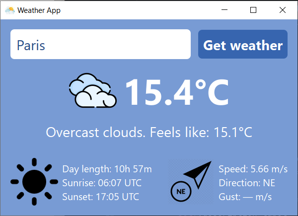

# Weather App



A modern, cross-platform desktop weather application built with Python and PyQt5 that provides real-time weather information for any city worldwide.

## Features

- **Current Weather Data**: Temperature, "feels-like" temperature, and weather conditions  
- **Visual Weather Icons**: Custom PNG icons for different weather conditions (with emoji fallback)  
- **Wind Information**: Speed, direction (with visual arrows), and gust data  
- **Sunrise/Sunset Times**: Day length calculation with UTC timestamps  
- **Robust Error Handling**: Clear messages for invalid input, network issues, API errors, and more  
- **Modern UI**: Clean, responsive interface with custom CSS styling  
- **Cross-Platform**: Works on Windows, macOS, and Linux  

## Requirements

- Python 3.6+
- PyQt5
- requests
- python-dotenv

## Installation

1. **Clone or download the project files**

2. **Install required packages**:
   ```bash
   pip install PyQt5 requests python-dotenv
   ```  
3. **Get an API key from OpenWeatherMap**:
   - Visit [OpenWeatherMap API](https://openweathermap.org/api)
   - Sign up for a free account
   - Generate an API key under your account settings

4. **Set up environment variables**:
   - Create a `.env` file in the project directory
   - Add your API key:
   ```env
   OPENWEATHER_API_KEY=your_api_key_here
   ```
> **Never commit your .env file to version control!** It’s already excluded via .gitignore

## File Structure
``` 
weather-app/
??? main.py              # Main application file
??? .env                 # Environment variables (create this)
??? icon.png             # Application icon (optional)
??? sun.png              # Sun icon (optional)
??? icons/               # Weather icons directory
?   ??? clear.png
?   ??? cloud.png
?   ??? rain.png
?   ??? snow.png
?   ??? thunderstorm.png
?   ??? mist.png
?   ??? dust.png
?   ??? volcano.png
?   ??? tornado.png
?   ??? unknown.png
??? directions/          # Wind direction icons
    ??? n.png
    ??? ne.png
    ??? e.png
    ??? se.png
    ??? s.png
    ??? sw.png
    ??? w.png
    ??? nw.png
```

## Usage

1. **Run the application**:
   ```bash
   python main.py
   ```

2. **Enter a city name** in the text field

3. **Click "Get weather"** or press **Enter** to fetch weather data

4. **View the weather information**:
   - Current temperature and feels-like temperature
   - Weather description with appropriate icon/emoji
   - Wind speed, direction, and gusts
   - Sunrise/sunset times and day length

## Error Handling

The app handles various error scenarios:
- Invalid city names
- Network connectivity issues
- API key problems
- Server errors
- Timeout situations

## Customization

### Icons
The app prioritizes PNG images over emojis:
- Place weather icons in the `icons/` directory
- Wind direction arrows in the `directions/` directory
- Optional `icon.png` for the application window
- Optional `sun.png` for the sun information section

### Styling
Modify the CSS in the `setStyleSheet` method to customize colors, fonts, and layout.

## API Information

This application uses the [OpenWeatherMap Current Weather Data API](https://openweathermap.org/current?spm=a2ty_o01.29997173.0.0.54e5c921n30CDC):
- Endpoint: `https://api.openweathermap.org/data/2.5/weather`
- Temperature is returned in Kelvin and converted to Celsius in the app
- Includes wind, clouds, sunrise/sunset, and detailed weather condition codes
- The free plan includes up to 1,000 API calls per day

## License

This project is for **educational purposes**. Please ensure you comply with [OpenWeatherMap's terms of service](https://openweathermap.org/themes/openweathermap/assets/docs/Openweather_website_terms_and_conditions_of_use.pdf) when using their API.

## Troubleshooting

- **"Invalid API key"**: Check your `.env` file and ensure the API key is correct
- **"City not found"**: Verify the city name spelling
- **No icons displayed**: Ensure the icon files are in the correct directories
- **Connection errors**: Check your internet connection

## Support

For issues or questions, please check:
- [OpenWeatherMap API documentation](https://openweathermap.org/api)
- [PyQt5 documentation](https://www.riverbankcomputing.com/static/Docs/PyQt5)
- [Python requests library documentation](https://docs.python-requests.org)
